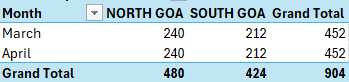

# Goa Fair Price Shop (FPS) Scraper & ETL Pipeline

Anyone who has worked with legacy or government web portals knows the pain: dynamic AJAX calls that silently fail, memory leaks during long-running headless browser sessions, unpredictable internet drops, and DOM elements that look updated but still contain stale data from previous calls.

This project is a resilient, fault-tolerant web scraping and ETL pipeline designed to scrape monthly Fair Price Shop (FPS) transaction data across Goa's districts from the Indian IMPDS portal (`impds.nic.in`).

Instead of relying on standard Selenium scripts that break down after an hour, this pipeline is engineered with automatic recovery, session recycling, stale DOM protection, and a decoupled two-stage data architecture.

---

## Key Engineering Challenges & Solutions

### 1. Stale DOM Detection (Preventing Silent Data Corruption)
* **The Problem:** When cycling through FPS shop links via JavaScript calls, slow networks or missed AJAX triggers often cause the webpage UI to retain the previous shop's data—even while claiming the click succeeded. Writing data at this stage results in duplicate records saved under wrong shop IDs.
* **The Solution:** Before parsing, the scraper extracts the live shop ID on the rendered DOM and compares it with the target ID. If `extracted_fps_id != target_fps_id`, a `Stale DOM Exception` is raised immediately to reject the bad payload.

### 2. Scheduled 15-Minute Chrome Session Recycling
* **The Problem:** Running hundreds of headless Chrome interactions causes memory leaks and severe browser slowdowns. On top of that, public web servers tend to throttle or drop long-lived active sessions.
* **The Solution:** A rolling timer monitors the active session age. Every 15 minutes, the script cleanly quits the Chrome instance, clears background memory, launches a fresh browser, and re-navigates back to the active district.

### 3. Tiered Auto-Recovery & Retry Logic
* **The Problem:** Network drops or unexpected server timeout errors can disrupt long batch scraping processes.
* **The Solution:** The scraper employs a two-tier retry strategy:
  * **Level 1 (Soft Retries):** Retries loading an individual shop up to 3 times with dynamic standard waits (`WebDriverWait`).
  * **Level 2 (Hard Reset):** If a shop fails after 3 attempts, the script teardowns the Chrome instance completely, boots up a fresh session, re-navigates back to the current district zone, and resumes operation seamlessly.

### 4. Idempotency & Seamless Job Resumption
* **The Problem:** Network failures or manual stops during a multi-hour scrape usually mean starting all over again.
* **The Solution:** Every target file path (`data/raw/.../FPS_ID_name.json`) is calculated deterministically prior to extraction. The scraper checks `os.path.exists(target_file)` and instantly skips already downloaded shops. If a crash occurs, re-running the script resumes exactly where it left off without duplicate network calls.

### 5. Decoupled Two-Stage Architecture (JSON Storage -> CSV ETL)
* **The Problem:** Scraping directly into a single flat CSV file mid-run leads to corrupted rows if the script crashes, and makes parsing nested tables (e.g., summary cards, PHH vs. AAY transaction matrices, commodity weight totals) extremely messy.
* **The Solution:** 1. **Scraping Stage (`get_raw_data.py`):** Dumps individual raw, deeply nested shop payloads into modular `.json` files.
  2. **ETL Stage (`consolidate_data.py`):** Reads raw JSON files, flattens hierarchical nested structures into standardized tabular columns, and outputs a consolidated CSV (`consolidated_fps_data.csv`).

```
[ IMPDS Portal ]
       │
       ▼
[ get_raw_data.py ]        Headless Chrome + Selenium + BeautifulSoup
       │                   • 15-min session recycling
       │                   • stale DOM checks
       │                   • skips shops already saved
       ▼
[ Raw JSON files ]         data/raw/YYYY-MM/district/FPS_ID_name.json
       │
       ▼
[ consolidate_data.py ]    pandas — flattens and merges everything
       │
       ▼
[ consolidated_fps_data.csv ]
```

## What actually gets pulled for each shop

Every JSON file looks roughly like this before it gets flattened:

```json
{
  "year": "2026",
  "month": "03",
  "state": "GOA",
  "district": "NORTH GOA",
  "fps_id": "158500100001",
  "fps_name": "M/S SANNA SANJAY PADTE",
  "summary_cards": {
    "total_etransaction": "412",
    "aadhaar_authenticated": "398",
    "other_mode_authenticated": "9",
    "non_authenticated": "5"
  },
  "number_of_transactions": [ /* PHH / AAY rows */ ],
  "number_of_transacted_ration_cards": [ /* PHH / AAY rows */ ],
  "distributed_quantity_kg": [ /* rice, wheat, sugar... regular/intra/inter/total */ ]
}
```

`consolidate_data.py` unpacks each of those nested blocks with a sensible column prefix — `txn_` for transactions, `rc_` for ration card counts, `dty_` for distributed quantities — so the final CSV ends up wide but flat, and every column name tells you exactly what it is without opening the raw JSON to check.

## Project layout

```
.
├── data/
│   ├── raw/                       # one JSON per shop, per month, per district
│   │   ├── 2026-03/
│   │   │   ├── north_goa/
│   │   │   └── south_goa/
│   │   └── 2026-04/
│   │       ├── north_goa/
│   │       └── south_goa/
│   └── processed/
│       └── consolidated_fps_data.csv
├── get_raw_data.py
├── consolidate_data.py
└── requirements.txt
```

## Running it

```bash
git clone https://github.com/dark-devil-14/impds-goa-fps-scraper
cd impds-goa-fps-scraper
pip install -r requirements.txt

python get_raw_data.py        # scrapes shop-by-shop, resumable if it dies
python consolidate_data.py    # flattens everything into one CSV
```

## A couple of things worth knowing before you run it

The months and zones being scraped are set right at the top of `get_raw_data.py`:

```python
years = [2026]
months = [3, 4]
goa_zones = ['NORTH GOA', 'SOUTH GOA']
```

Change those to pull different months or add more zones later.

## Before you run this: the flaws section

Every scraper has rough edges. Here are mine, laid out properly instead of buried in a comment somewhere.

### It will take a very, very long time — and that's fine

This isn't a five-minute script. It's fetching hundreds and hundreds of individual shop pages, one click at a time, with deliberate waits built in so it doesn't outrun a government server that wasn't built for speed. Depending on how many shops a district has, one month of one zone alone can take a good while. Multiply that across two zones and two months and you're looking at a genuinely long, multi-hour run.

So: start it, walk away, let it work. Don't panic if the terminal is quiet for a stretch — that's just `WebDriverWait` doing its job, not the script hanging. The one thing that actually matters on your end is a **stable internet connection** for the duration. The script tolerates *drops* gracefully (more on that below), but it can't do anything about a connection that's down for good.

### It genuinely doesn't mind if you interrupt it

This is the part I'm most confident about. If your Wi-Fi dies mid-run, if you hit `Ctrl+C` because you need your laptop back, if the power goes out — none of that is a disaster. Just run `python get_raw_data.py` again.

Here's why it's safe to do that: before touching the browser for any given shop, the script already knows exactly what the output filename *would* be, and it checks whether that file already exists. If it does, that shop is skipped, no questions asked. So a re-run doesn't re-scrape anything you already have — it just picks up at the first shop that's still missing and continues from there. No duplicate files, no duplicate network calls, no wasted hours re-downloading data you already paid the time cost for once.

### It's dynamic in one way, and stubbornly hardcoded in another

This trips people up, so it's worth being precise about it.

**What *is* dynamic:** the month and year. Right at the top of `get_raw_data.py` you'll find:

```python
years = [2026]
months = [3, 4]
```

Add a year, add a month, and the script builds the right URL and folder structure for it automatically — `data/raw/2026-05/...` just appears on its own. No other code needs to change for that.

**What is *not* dynamic:** the state and the districts. Right now the script is wired specifically to click on **GOA**, and only knows about two zones:

```python
goa_zones = ['NORTH GOA', 'SOUTH GOA']
```

If you want more districts within Goa, or a different state entirely, you can't just add a name to a list and expect it to work - you have to go find that name first. Open the IMPDS portal yourself, navigate to the state you want, and look at the actual page source for the district link's `title` or `aria-label` attribute. Whatever text sits there - copy it **exactly**, in the **same capitalisation** the site uses. The zone-matching logic looks for that string verbatim, so `"North Goa"` won't match where `"NORTH GOA"` would.

And a step further: switching states isn't just a list edit at all. The very first click in `navigate_to_district()` is hardcoded to look for an element whose title contains `'GOA'`:

```python
"//a[contains(@title, 'GOA')] | //img[contains(@aria-label, 'GOA')]"
```

To point this at a different state, that line itself needs editing, not just the zones list. So think of the script as "dynamic for time, hardcoded for geography" - changing *when* you scrape is a config change, changing *where* is a small code change.

### The consolidator doesn't know what it doesn't know

`consolidate_data.py` has its own version of the same problem, and it's a quieter one because it fails silently rather than with an error.

```python
loop_path = ["2026-03//north_goa", "2026-03//south_goa", "2026-04//north_goa", "2026-04//south_goa"]
```

This file is hand - typed and only covers exactly four month/zone combinations. If you scrape a new month with `get_raw_data.py` say May - that data lands correctly on disk in `data/raw/2026-05/...`, but `consolidate_data.py` has no idea it exists. It won't error, it won't warn you, it will just build the CSV from the four folders it already knows about and quietly leave May out entirely. The fix is manual: add the new `"YYYY-MM//zone_name"` entry to `loop_path` yourself before re-running the ETL step.

### Smaller things worth knowing about

A few more things :

- **The log file is the terminal.** Every status update — successes, retries, stale DOM catches, reboots - goes to the console via `print()` and nowhere else. For a run that might last hours unattended, that means if something worth knowing happened at hour three, you'll only see it if you happened to be watching the terminal at the time, or you redirect output to a file yourself (e.g. `python get_raw_data.py > run_log.txt`).
  
- **Shop ID and name extraction leans on regex against the sidebar link text.** It assumes the portal always formats entries as something like `"158500100001 : SHOP NAME - extra text"`. If the government ever changes that formatting even slightly, the ID or name extraction can silently produce garbage rather than erroring out, since regex failures here don't currently raise an exception.
  
- **No duplicate data ever makes it in twice** — that's a genuine strength worth calling out, not a flaw. Between the stale - DOM check on the scrape side and the file-exists skip on resume, i have structurally protected from the same shop's data landing in the dataset more than once.
  
- **ChromeDriver version isn't pinned or auto-managed.** The script assumes a Chrome browser and matching driver are already installed and on the PATH. If Chrome auto-updates itself and your driver falls behind, you'll get a version - mismatch error at `create_driver()` with no built-in recovery for that specific case - it's a manual driver update.

- **Unnamed FPS Records**: FPS entries missing a name are saved under their unique fps_id. In consolidated_fps_data.csv, the name field is left blank for these specific IDs."
  
- Images are blocked in the headless Chrome session on purpose (`profile.managed_default_content_settings.images: 2`) — a real, speed win across hundreds of shop pages, since all the data we actually need is text and tables anyway.

## Requirements

- Python 3.9+
- Chrome + a matching ChromeDriver on your PATH
- `selenium`, `beautifulsoup4`, `pandas`

--
## Data Verfication
- Verified the data on my side to ensure no FPS records were missing. To my surprise, it retrieved everything perfectly!!

